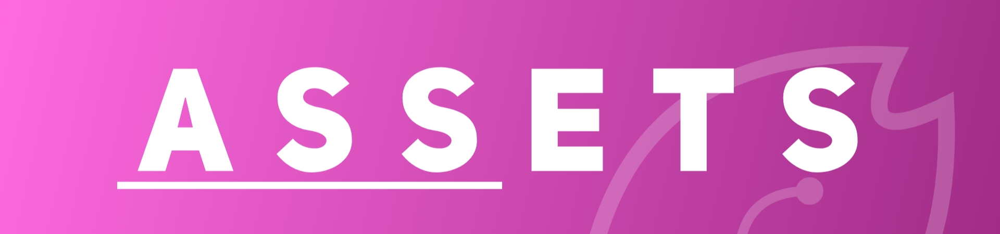

---
This repository contains assets used by our projects. \
Please check the project folder in this repository for license details.

## Assets Type
- `Official` means we have full rights and permissions over this asset. This asset is usually created by our team or a 3rd party at our request.
- `Unofficial` means we don't have full rights and permissions over this asset.